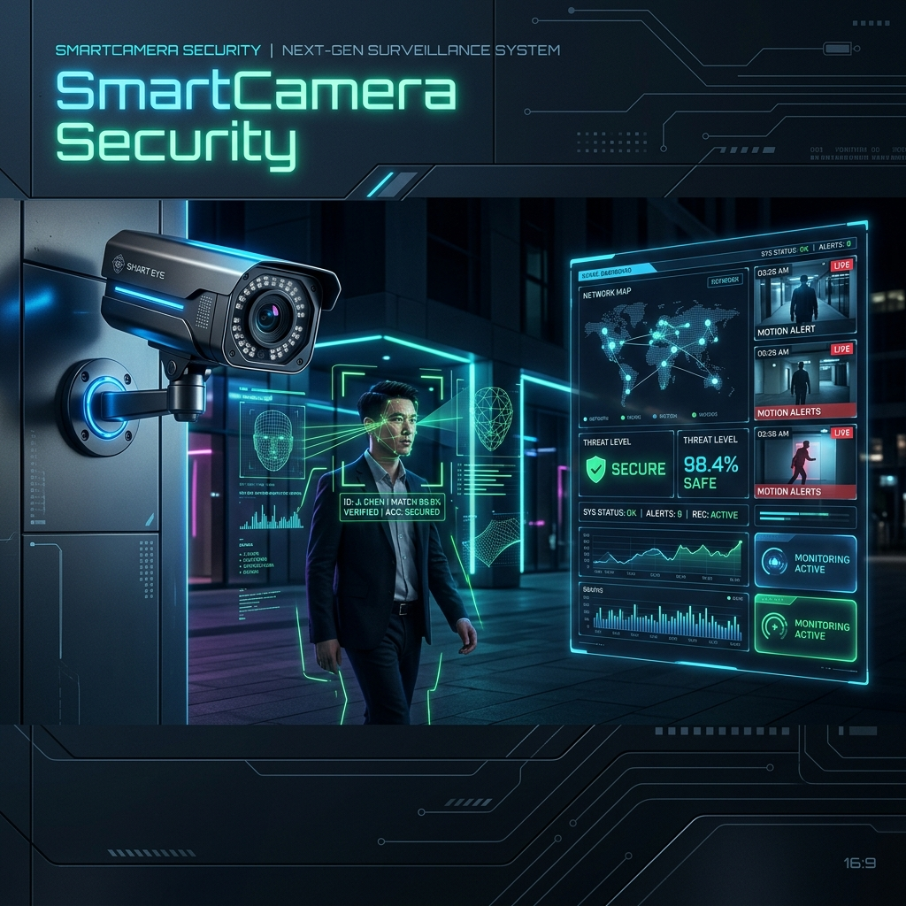

# 🛡️ Smart-Camera-Security-with-Face-Recognition

### Hệ Thống Giám Sát Thông Minh Tích Hợp Nhận Diện Khuôn Mặt & Phát Hiện Khẩu Trang

[](https://www.python.org/)
[](https://www.riverbankcomputing.com/software/pyqt/)
[](https://opencv.org/)
[](https://pytorch.org/)
[](https://www.mongodb.com/)

**SmartCamera Security** là giải pháp an ninh hiện đại sử dụng trí tuệ nhân tạo (AI) để giám sát và quản lý khu dân cư. Hệ thống không chỉ nhận diện danh tính người ra vào mà còn hỗ trợ kiểm soát việc tuân thủ quy định đeo khẩu trang, tất cả đều được tích hợp trong một giao diện người dùng trực quan.

[Tính năng](#-tính-năng-chính) • [Công nghệ](#-công-nghệ-sử-dụng) • [Kiến trúc](#-cấu-trúc-thư-mục) • [Cài đặt](#-hướng-dẫn-cài-đặt) • [Sử dụng](#-hướng-dẫn-sử-dụng)

</div>

---

## ✨ Tính Năng Chính

### 🆔 Nhận Diện Khuôn Mặt (Face Recognition)
- Sử dụng mô hình **InsightFace** kết hợp với **RetinaFace** để đạt độ chính xác cực cao.
- Tính toán độ tương đồng Cosine (Cosine Similarity) để xác định danh tính từ cơ sở dữ liệu.
- Hiển thị thông tin tên, địa chỉ và điểm tin cậy (Confidence Score) thời gian thực trên luồng Camera.

### 😷 Phát Hiện Khẩu Trang (Mask Detection)
- Tích hợp mô hình phân đoạn hình ảnh **U-Net** (Segmentation) để phát hiện khẩu trang.
- Cảnh báo trực quan ngay trên màn hình khi phát hiện người không đeo khẩu trang hoặc đeo không đúng cách.

### 👥 Quản Lý Cư Dân (Resident Management)
- Giao diện Dashboard hiện đại cho phép:
    - Thêm mới cư dân và lấy mẫu khuôn mặt tự động qua Camera.
    - Danh sách cư dân với đầy đủ thông tin chi tiết.
    - Lưu trữ an toàn trên **MongoDB**.

### 🖥️ Giao Diện Người Dùng (Modern UI)
- Xây dựng trên nền tảng **PyQt6** với thiết kế Sidebar hiện đại.
- Trải nghiệm mượt mà với tính năng chuyển đổi tab: Dashboard, Camera, Thêm mới, Danh sách.

---

## 🛠️ Công Nghệ Sử Dụng

| Thành phần | Công nghệ chính |
|:---|:---|
| **Ngôn ngữ** | Python 3.10+ |
| **Giao diện (UI)** | PyQt6 |
| **Thị giác máy tính** | OpenCV, InsightFace, RetinaFace, MTCNN |
| **Học sâu (Deep Learning)** | PyTorch (U-Net), TensorFlow/Keras (FaceNet) |
| **Cơ sở dữ liệu** | MongoDB (Atlas/Local) |
| **Lưu trữ đám mây** | Cloudinary (Dành cho ảnh cư dân) |
| **Xử lý dữ liệu** | NumPy, Scikit-learn, Matplotlib |

---

## 📁 Cấu Trúc Thư Mục

```text
SmartCamera-Security/
├── app/                        # Logic ứng dụng chính
│   ├── api/                    # Cung cấp API (Phát triển tương lai)
│   ├── core/                   # Cấu hình Database, Security, Env
│   ├── modelsAI/               # Chứa các Model AI (U-Net, InsightFace)
│   │   ├── insightFace/        # Logic nhúng (embedding) khuôn mặt
│   │   └── unet/               # Logic phân đoạn phát hiện khẩu trang
│   ├── UI/                     # Giao diện PyQt6 (Sidebar, Camera, Forms)
│   ├── services/               # Logic nghiệp vụ (Kết nối DB, Xử lý ảnh)
│   ├── utils/                  # Các hàm tiện ích (Crop image, ...)
│   ├── main.py                 # File khởi chạy ứng dụng chính
│   └── tesst.py                # Script chạy thử nghiệm nhận diện
├── dataset/                    # Dữ liệu huấn luyện và đánh giá AI
├── scripts/                    # Các kịch bản phụ để đánh giá Model
├── docs/                       # Tài liệu và hình ảnh minh họa
├── uploads/                    # Lưu trữ tạm thời các file tải lên
├── .env                        # Chứa biến môi trường (Sensitive)
├── .gitignore                  # Cấu hình bỏ qua của Git
├── README.md                   # Tài liệu hướng dẫn sử dụng
└── requirements.txt            # Danh sách các thư viện cần thiết
```

---

## 🚀 Hướng Dẫn Cài Đặt

### 1. Yêu cầu hệ thống
- Python >= 3.10
- Webcam (Để sử dụng tính năng Camera)
- MongoDB Connection String (Local hoặc Cloud)

### 2. Clone Repository
```bash
git clone https://github.com/PhanVanTann/Smart-Camera-Security-with-Face-Recognition.git
cd Smart-Camera-Security-with-Face-Recognition
```

### 3. Thiết lập môi trường ảo (Venv)
```bash
# Tạo môi trường ảo
python -m venv venv

# Kích hoạt trên macOS/Linux:
source venv/bin/activate
# Kích hoạt trên Windows:
venv\Scripts\activate
```

### 4. Cài đặt thư viện
```bash
pip install -r requirements.txt
```

### 5. Cấu hình biến môi trường
Tạo file `.env` tại thư mục gốc và điền các thông tin sau:
```env
MONGODB_URI=your_mongodb_uri
CLOUDINARY_URL=your_cloudinary_url
THRESHOLD=0.7
```

---

## 💻 Hướng Dẫn Sử Dụng

### Chạy ứng dụng chính (GUI)
Để khởi động giao diện Dashboard quản lý:
```bash
python app/main.py
```

### Chạy script kiểm tra nhận diện (CLI/OpenCV)
Để kiểm tra nhanh khả năng nhận diện và phát hiện khẩu trang qua cửa sổ OpenCV:
```bash
python app/tesst.py
```

---

## 🤝 Đóng Góp

Mọi ý kiến đóng góp và báo lỗi (Issues) luôn được chào đón. Để đóng góp:
1. Fork dự án.
2. Tạo nhánh tính năng (`git checkout -b feature/NewFeature`).
3. Commit thay đổi (`git commit -m 'Add some NewFeature'`).
4. Push lên nhánh (`git push origin feature/NewFeature`).
5. Tạo Pull Request.

---

## 📄 Tác Giả

- **Phan Văn Tấn** - [@PhanVanTann](https://github.com/PhanVanTann)

---

<div align="center">

**⭐ Nếu bạn thấy dự án hữu ích, hãy tặng một ngôi sao nhé! ⭐**

